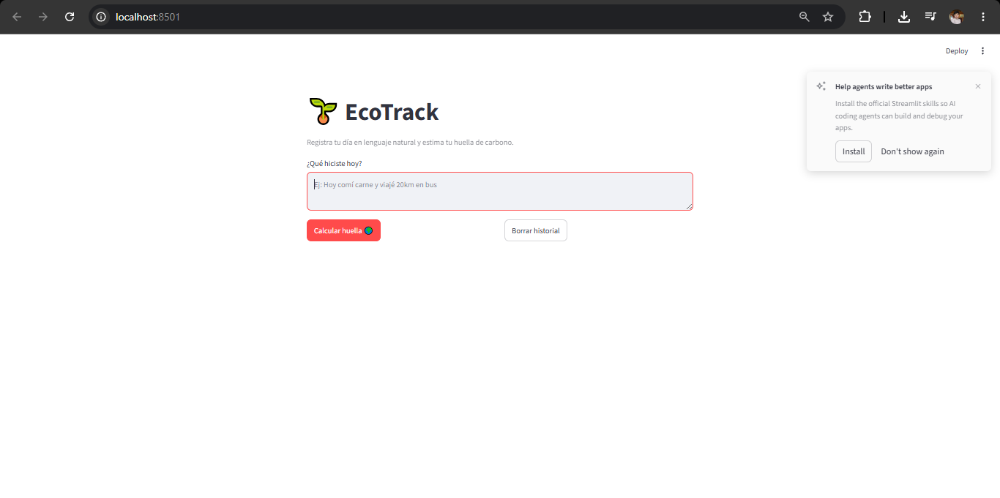

# EcoTrack MVP

Prototipo de "vibe coding": registra tu huella de carbono diaria
escribiendo una frase en lenguaje natural (ej. *"Hoy comí carne y viajé
20km en bus"*) y obtén un estimado de CO2.

## Ejecutar localmente

```bash
pip install -r requirements.txt
python -m streamlit run app.py
```

## Desplegado en Replit

Importa este repositorio en Replit (o usa el Repl ya creado) — el archivo
`.replit` ya define el comando de arranque (`python -m streamlit run app.py`).

## Archivos clave

- `app.py` — lógica de parsing + interfaz Streamlit.
- `CLAUDE.md` — reglas del agente de IA para este proyecto (equivalente a
  `.cursorrules`).
- `vibe_report.md` — reflexión sobre el proceso de vibe coding.

## Imagen de prubea
